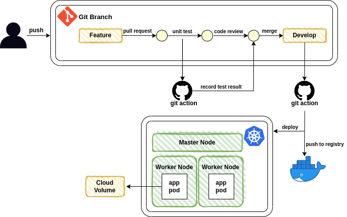
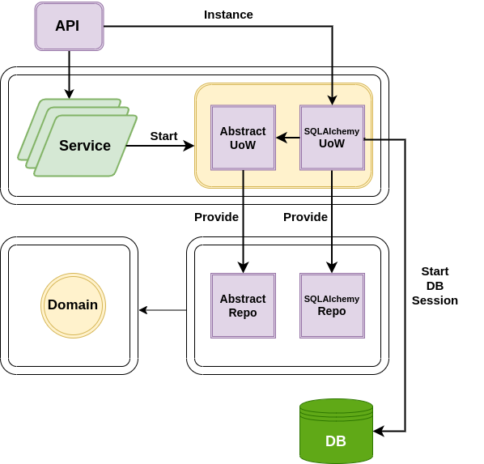
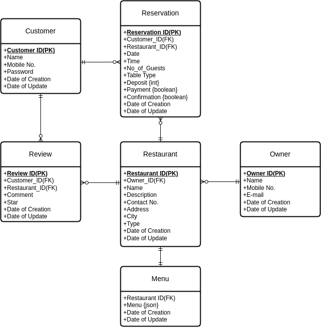

CatchTable - Restful API server
=============
전국의 레스토랑을 찾고 예약할 수 있는 중개 플랫폼 서버입니다.<br>
Fast API 프레임워크를 사용해 REST API 서버를 구현했습니다.<br>
Clean Architecture를 구성하려고 노력하였고, 테스트 주도 개발을 하였습니다.<br>
Gitflow를 이용하여 Master, Develop, Feature로 branch를 구분하여 관리합니다.

## CatchTable 서버 구조


## CatchTable Architecture 구조 


## ER Diagram


## Environments
1. Python3.8
2. Docker 1.42 (minimum 1.12)
3. Ubuntu 20.04

## Installing dependencies
1. Create virtualenv
```sh
$ pip3 install virtualenv
$ virtualenv env
$ source env/bin/activate
```
2. Install dependencies
```sh
$ git clone https://github.com/f-lab-edu/CatchTable.git
$ cd CatchTable
$ pip install -r requirements.txt
```
